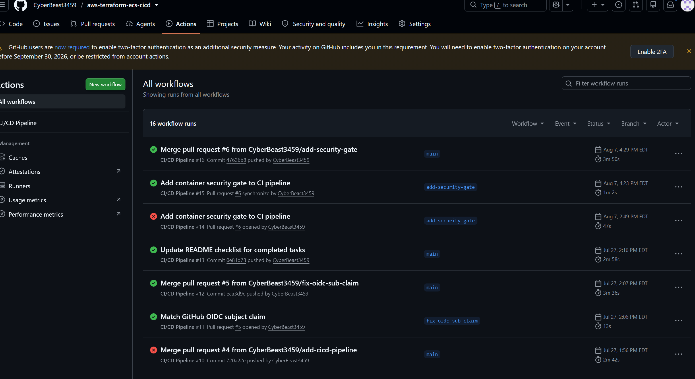
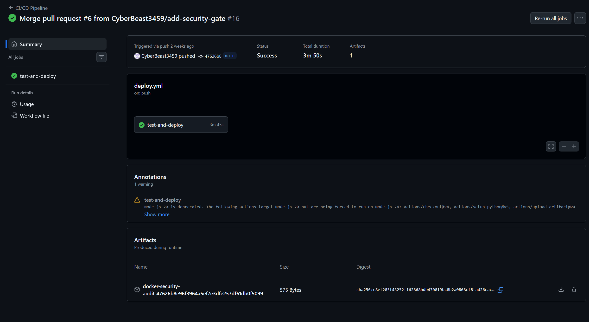
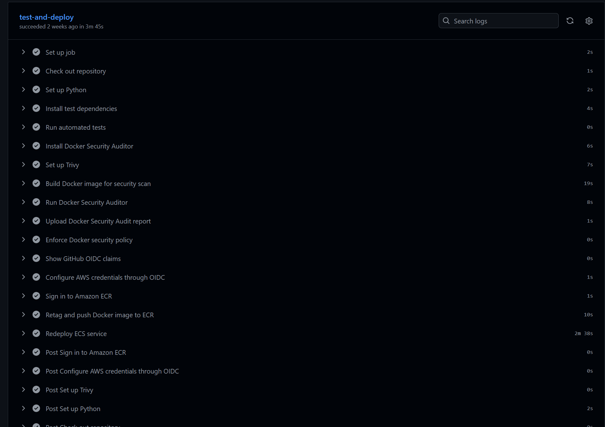

# AWS Terraform ECS CI/CD

A portfolio project that deploys a containerized Flask status dashboard to Amazon ECS Fargate. Infrastructure is provisioned with Terraform, and GitHub Actions will test, build, scan, and publish the application to Amazon ECR before deploying it to ECS.

## Planned architecture

`GitHub → GitHub Actions → Amazon ECR → Amazon ECS Fargate → Application Load Balancer`

Container logs are sent to Amazon CloudWatch Logs.

## Project status

The project is complete. The Flask application is tested and containerized with a non-root runtime user; Terraform provisions the AWS infrastructure; and GitHub Actions runs the automated tests, enforces the container security gate, authenticates through AWS OIDC, publishes the approved image to Amazon ECR, and redeploys the Amazon ECS Fargate service.

## Run locally

```bash
python -m venv .venv
source .venv/bin/activate
pip install -r requirements-dev.txt
pytest
flask --app app.app run --port 8080
```

Open `http://localhost:8080` and verify `http://localhost:8080/health`.

## Run with Docker

```bash
docker build -t cloud-status-dashboard .
docker run --rm -p 8080:8080 cloud-status-dashboard
```

## CI/CD security gate

The GitHub Actions pipeline now runs in this order:

1. Install dependencies and run the automated test suite.
2. Build the Docker image once with `docker build --pull` and tag it immutably as `cloud-status-dashboard:${{ github.sha }}`.
3. Run the Docker Security Auditor and write the report to `reports/docker-security-audit.json`.
4. Upload the JSON report as an artifact named `docker-security-audit-${{ github.sha }}` so it can be downloaded from the Actions run.
5. Enforce the security gate: exit code `0` passes, exit code `1` (MEDIUM) logs a warning and continues, and exit codes `2` or `3` (HIGH or CRITICAL) fail the workflow and block the image from being pushed. Exit code `4` or any unexpected code is treated as an operational error.
6. On pushes to `main`, only after the gate passes, authenticate with AWS OIDC, log in to ECR, and push the already-scanned image under both the commit tag and `latest`.

MEDIUM findings generate a warning but do not block deployment. HIGH and CRITICAL findings block deployment until the image is remediated.

## CI/CD Pipeline Evidence

### Workflow history

The GitHub Actions history demonstrates the pipeline’s iterative development through pull requests, including the completed container security gate and a successful deployment from the `main` branch.



### Successful pipeline run

The completed workflow ran the full test, security, build, and deployment process successfully. The run also produced a downloadable Docker Security Audit report as a workflow artifact.



### Security gate and AWS deployment

Before deployment, the pipeline runs automated tests, builds the Docker image, performs Trivy-backed auditing, uploads the security report, and enforces the container security policy. After approval, GitHub Actions authenticates to AWS through OIDC, pushes the image to Amazon ECR, and redeploys the Amazon ECS service.



## Project stages

- [x] Flask application and automated tests
- [x] Dockerfile using a non-root runtime user
- [x] Terraform infrastructure code
- [x] Amazon ECR repository configuration
- [x] Amazon ECS Fargate service configuration
- [x] CloudWatch logs and load-balancer health-check configuration
- [x] Successful AWS deployment
- [x] GitHub Actions CI/CD with AWS OIDC authentication
- [x] Architecture diagram, screenshots, and deployment documentation

## Cost note

The Terraform configuration intentionally uses public subnets without a NAT gateway. The Application Load Balancer, Fargate task, public IPv4 addresses, ECR storage, and CloudWatch usage can still incur charges while deployed. Run `terraform destroy` after capturing the project evidence if the environment is no longer needed.
